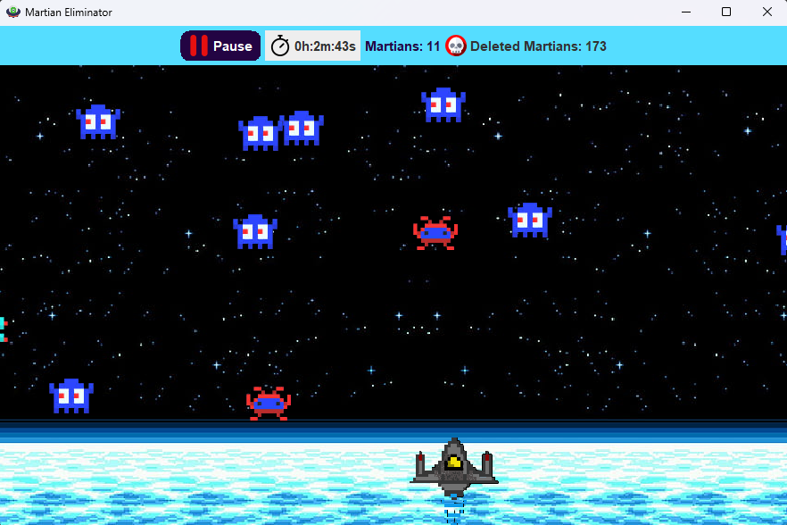

# Kill Martians Game

Este es un pequeño proyecto en java, desarrollado con la intención de aprender y practicar Threads. Este es un juego de matar marcianos. El proyecto es simple, se espera que a futura se haga mejoras y nuevos lanzamientos.

## Pre-requisitos 📋

- Java 17
- Windows 11 o Superior: Se desarrolló en windows 11, pero no esta probando en otro sistema operativo.

## **Ejecución**
Cada lanzamiento que se hace en el repositorio tendra un .jar del proyecto el cual se llama: **``KillMartianGame``** *más la respectiva versión del juego, ejemplo: **KillMartianGame_V_1.0.0***. Para poder utilizar este jar o mejor dicho ejecutarlo, sólo se debe abrir la consola de comandos dentro de esta carpeta y escribir: 
```
java –jar KillMartianGame_V_1.0.0.jar
``` 
y el jar empezara a ejecutarse sin ningún problema.

## Lanzamientos

| **KilMartianGame_V_1.0.0 *Versión 1***     |
| :-------- |
| Por el momento, se pueden matar marcianos que apareceran aleatoriamente en la pantalla, con la ayuda de una nave, que esta ubicada en la parte inferior de la ventana. El juego cuenta con efectos de sonido. El programa también cuenta con un botón de inico y pausa del juego, además contadores de la cantidad de marcianos que estan en la pantalla y los que han sido elimidados; además un cronómetro para el tiempo que lleve jugando. 
|

#

    